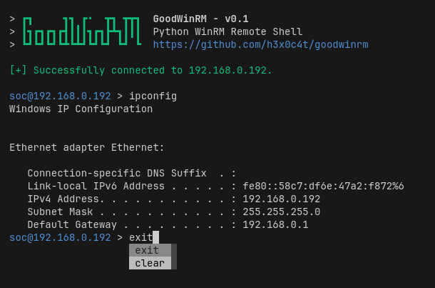

# GoodWinRM

Python WinRM Remote Shell.



## Installation

```bash
pipx install git+https://github.com/h3x0c4t/goodwinrm
pipx ensurepath
```

## Usage

```
$ goodwin --help

> ┏┓     ┓┓ ┏•  ┳┓ ┳┳┓  GoodWinRM - v0.1
> ┃┓┏┓┏┓┏┫┃┃┃┓┏┓┣┻┓┃┃┃  Python WinRM Remote Shell
> ┗┛┗┛┗┛┗┻┗┻┛┗┛┗┛ ┗┛ ┗  https://github.com/h3x0c4t/goodwinrm
    
usage: goodwinrm [-h] -i IP -u USERNAME -p PASSWORD [-t TRANSPORT] [-v SERVER_CERT_VALIDATION] [-d DIRECTORY] [--https HTTPS]

WinRM Remote Shell

options:
  -h, --help            show this help message and exit
  -i IP, --ip IP        Remote host IP or hostname.
  -u USERNAME, --username USERNAME
                        Username.
  -p PASSWORD, --password PASSWORD
                        Password.
  -t TRANSPORT, --transport TRANSPORT
                        Transport protocol. ['basic', 'ntlm', 'kerberos', 'credssp', 'ssl', 'certificate']
  -v SERVER_CERT_VALIDATION, --server_cert_validation SERVER_CERT_VALIDATION
                        Server certificate validation. ['ignore', 'validate']
  -d DIRECTORY, --directory DIRECTORY
                        Working directory.
  --https HTTPS         Use HTTPS.
```